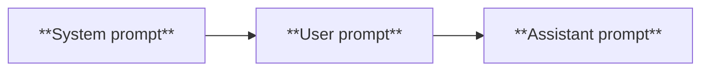

# 今天学一学week1的内容

摘要写在 more 标记前面。

<!-- more -->

## week 1-1: intro to this course

### the overall challenge for SWEs

- But there is some good news
    
- Students learning CS today have the potential to be an order of magnitude better than I was when I was learning. 
    
- Part of the software engineering identity crisis is about asking ourselves what it really means to be a developer?
    
- If your only value add is knowing how to copy-paste from Stackoverflow then you will be replaced by AI
    
- If you think in terms of systems, understand business context, think through resilient architectures and abstractions, AI will strap a rocket to your back in terms of productivity
    
- I promise I will teach you the state-of-the-art in how to use AI in software development today. This will make you irreplaceable
    

### This is not vibe coding

- This is not the vibe coding class. 
    
- Vibe coding has different definitions but the standard one of just YOLO-ing and tab-accepting AI code is not the focus here
    
- I’ll tell you why: vibe coding is just not good enough to truly build good software. Hard to predict but we’re likely 2-10+ years away from that being a viable way to build robust production-level software
    
- Again this is not a class to teach non-technical users how to not have to hire developers.
    
- This is a class for fairly experienced engineers to truly become 10x engineers
    
别幻想着vibe coding能解决一切，说的就是我。

### The Takeaway

- **Human-agent engineering(人-智能体协作工程)**:把精力放在 AI 还替代不了的技能上——业务理解、当 tech lead(技术负责人)。
- <strong>"LLMs are only as good as you are"</strong>: 好的 **context(上下文)** 才有好的代码;<strong>如果你自己都读不懂你的代码库,LLM 也读不懂</strong>。
- **Read and review a lot of code(大量读和审代码)**:培养"品味(taste)",学会分辨好代码与坏代码。
- **Experiment aggressively(大胆试验)**:这个领域<strong>还没有成熟的软件范式(no established patterns yet)</strong>,大家都在摸索。

### How LLM works

Too basic, I already learnt in ECE364.

 token预测的贝叶斯公式揭示了为什么上下文长度这么重要。当然这也是这整门课唯一的公式。
 
自注意力机制，参考transformer论文，链接待补充。

LLM训练流程。

- **Stage 1 — Self-supervised pretraining(自监督预训练)**:在海量公开数据(Common Crawl、Wikipedia、StackExchange、公开 GitHub 仓库)上学"语言和代码长什么样",规模是<strong>千亿到万亿+ token</strong>。此时你说"写个 for 循环",它只会续写出"可能出现在某段代码里"的东西。

- **Stage 2 — Supervised finetuning(监督微调,SFT)**:用几万到几十万条<strong>高质量的"指令-回答"对</strong>教它**听懂指令**。现在你说"写个 for 循环",它知道"哦,你要我给你一个 for 循环"。

- **Stage 3 — Preference tuning(偏好微调)**:用人类对同一问题的多个回答的偏好对比,训练一个 **reward model(奖励模型)**,让输出更符合人类偏好(有用、正确、可读)。现在它会给你 `for idx in range(10):` 这种地道的代码。

- **Slide 18 — Reasoning models(推理模型)**:再往上,用 **chain-of-thought(思维链)** 的推理轨迹、工具调用、对推理步骤的强化学习(RL),让模型学会"想一步、回溯、再想"。


### 实战优缺点

- **Strengths(强项)**:专家级代码补全、代码理解、代码修复。
- **Limitations(局限)**:
    - **Hallucinations(幻觉)**:编造不存在/过时的 API——slides 明确说,这要靠**稳健的 context engineering(上下文工程)** 来缓解。
    - **Context window limits(上下文窗口限制)**:约 100–200K token,而且<strong>"不是每个 token 都同等重要"</strong>(越长越容易丢中间信息)。
    - **Latency(延迟)**:每次请求几秒到几分钟,要据此规划和拆分任务。
    - **Cost(成本)**:最好的模型,输入约 $1–3 / 百万 token,输出 $10+ / 百万 token。


## Week 1-2: LLM Power Prompting

prompting其实是在给LLM编程，是驱动LLM的通用语（lingua franca）。

在 llm-wiki 里,prompt 模板就是"业务逻辑代码"。

??? note "疑问：为什么不用LLM去写prompt？2026年了还有人教prompt engineering？"
    下文的A\ prompt改进器？
    [Claude's system prompt](https://claude.ai/public/artifacts/6e8ffdf3-3faa-4b43-ba76-4c789568e368)

### Self-consistency Prompting(自一致性)

**多次采样**(通常配合 CoT),然后**取最常见的结果(majority vote / 多数表决)**。原理是一种 **model ensembling(模型集成)**:通过采样多条不同的推理路径,把偶发的错误/幻觉投票投掉。slide 13 的例子是:同一个 `IndexError` 让模型分析 5 次根因,取多数结论。

> 工程直觉:这相当于"让模型自己开会投票"。代价是 5 倍的调用成本和延迟,所以用在"对正确性要求高、值得花钱"的地方。


### Tool Use(工具调用)

让 LLM **把它搞不定的事,委托给一个外部系统**。slides 把它定性为<strong>"减少幻觉、实现 LLM 自主性最重要的技巧之一"</strong>。slide 15 的例子:修完 IndexError 后,给模型一组可用工具(用 `<tools>` 标签列出 `pytest` 命令),让它自己跑测试验证。

为什么治幻觉?因为模型不再"凭记忆瞎猜 API 行不行",而是真去调一个工具拿到真实结果。


```
Fix the IndexError. Ensure the CI tests still pass once you have made the fix. Here are the available tools. 

<tools>

pytest -s /path/to/unit_tests

pytest -v /path/to/integration_tests

</tools>

```


### Retrieval Augmented Generation(检索增强生成,RAG)

**给 LLM 注入上下文数据**。好处 slides 列了四条:

1. **保持最新**:不用重训模型就能让它知道新知识,迭代更快。
2. **可解释 + 引用(interpretability and citations)免费送**:答案能标注来源。
3. **减少幻觉**。

```
I want to extend the UserAuthService class to check that the client provides a valid OAuth token. 

Here is how the UserAuthService works now:  
<code_snippet>
def issue_oauth_token():
			….
</code_snippet>

Here is the path to the requests-oauthlib documentation:  
<url>
https://requests-oauthlib.readthedocs.io/en/latest/
</url>

```

### Reflexion(反思)

让 LLM **对自己的输出做反思**。机制是:执行一个动作、观察环境反馈后,把"口头反馈"重新塞回上下文,让它修正。

- 典型做法:在 prompt 后面加一句后缀——<strong>"现在批判你自己的答案。它对吗?如果不对,解释为什么,然后再试一次。"</strong>
- 本质是 **multi-turn prompting(多轮提示)**:第一轮模型先试一版;第二轮你问"对吗?反思并修订"。
- slide 19 的例子用 **observe(观察)→ reflect(反思)→ extend prompt(扩展提示)** 的循环修一个 `JSONDecodeError`。

### 三种角色(System / User / Assistant)

这几页讲 LLM 对话的三个**角色(role)**,你必须分清,因为你代码里天天在用:

- **System prompt(系统提示)**:给 LLM 的**第一条消息**,通常用户看不到。负责设定**人设(persona)、输出规则、风格**。
- **User prompt(用户提示)**:人类**实际的提问/指令**——前面所有例子都是。
- **Assistant(助手)**:LLM **实际生成的内容**。

[Claude's system prompt](https://claude.ai/public/artifacts/6e8ffdf3-3faa-4b43-ba76-4c789568e368)
非常长，**Almost like a loosely followed Isaac Asimov’s 3 laws of robotics**




??? note "疑问：既然三者都是prompt，在输入token的时候仅仅被记号token分割，system prompt和user prompt有什么区别呢？"
	

### Best Practices(最佳实践)

这是把六个技巧落地的操作守则:

- **Slide 25**:可以用 Anthropic 官方的 **prompt improver(提示改进器)** 自动优化 prompt;判断 prompt 清不清楚有个土办法——<strong>"把它给一个上下文很少的人看,如果他困惑,LLM 也会困惑"</strong>;**大胆使用 role prompting(角色提示)** 强化 system prompt。
- **Slide 26 / 28**:两个 role prompting 的对比例子——"你是一个资深工程师水平、详尽又较真的助手" vs. "你是个 Gen Z 数字闺蜜,永远像凌晨两点在 Snapchat 上发消息"。同一个模型,人设一换,输出风格完全不同。
- **Slide 29**:<strong>prompt 要有结构(format with structure)</strong>,用 `<log>`、`<error>` 这样的标签把日志和堆栈分块。
- **Slide 30**:**明确说清楚你要什么**(语言、技术栈、库、约束),并且**拆解任务(decompose tasks)**。


[A\ prompt improver](https://docs.anthropic.com/en/docs/build-with-claude/prompt-engineering/prompt-improver)

prompt 结构；
```
Here are the logs:  
<log>  
LOG MESSAGE

<log> and the stack trace:  
<error>  
STACK TRACE  
<error>
```


## Readings


## Assignment1


### k_shot_prompting 

我已深刻领悟到，prompt好好写其实是有用的。

这个sys prompt自己写的话还真不太好写。
#### 第一版prompt

我的第一版：
```
You are a word reverse expert, your mission is reverse every letters in a word accurately.

Here are some examples:

1. input: hello, output: olleh

2. input: exclude, output: edulcxe

3. input: university, output: ytisrevinu

4. input: student, output: tneduts

5. input: accident, output: tnedicca
```

稍微有点蠢，但是测试结果只比zero shot好了一点点

??? note "zero shot测试结果："
    Running test 1 of 5
    
	Expected output: sutatsptth
	
	Actual output: tsetpuH
	
	Running test 2 of 5
	
	Expected output: sutatsptth
	
	Actual output: statpuhctoS
	
	Running test 3 of 5
	
	Expected output: sutatsptth
	
	Actual output: stauspoth
	
	Running test 4 of 5
	
	Expected output: sutatsptth
	
	Actual output: statspohth
	
	Running test 5 of 5
	
	Expected output: sutatsptth
	
	Actual output: sattotsuP

??? note "第一版prompt测试结果："
	Running test 1 of 5
	
	Expected output: sutatsptth
	
	Actual output: ssutptoh
	
	Running test 2 of 5
	
	Expected output: sutatsptth
	
	Actual output: satsuptth
	
	Running test 3 of 5
	
	Expected output: sutatsptth
	
	Actual output: sattostpuH
	
	Running test 4 of 5
	
	Expected output: sutatsptth
	
	Actual output: tsuxthp
	
	Running test 5 of 5
	
	Expected output: sutatsptth
	
	Actual output: tsuxthp


cc给了我一个思路，模型是以token为单位看待文本的，所以一个单词他是以整体看待的，模型看不见单个字母。
那该怎么办。


#### 第二版prompt
经过和opus 4.8的一些讨论，我写了第二版sys prompt

??? note " 第二版prompt 结果："
	YOUR_SYSTEM_PROMPT = """
	YOUR_SYSTEM_PROMPT = """
	
	You are a English word reverse expert, your role is to extract every letters in the given English word and reorder it to the opposite order. You only do this thing at a time.
	
	output role: no explination, only the reversed word. You can think the explination in your thinking process, bit never treat it as the output.
	
	  
	
	Examples:
	
	task explination: you need to breakdown the word first by inserting blank space into it, making the word a bunch of independent tokens, then reverse the order.
	
	Lastly, delete the blank within every letters, generate the output without any blanks. The reversed version of word must have the same amount of letters as the original word.
	
	You can count the length of input word first, then examine the number of letters of the output with the lenth of the input word.
	
	Be careful of the letters that's same as the letter next it, like the 'tt' in 'letter'. Make sure do not miss any of them.
	
	As you just receive the token of a word, to know how to spell the word first, you might confirm the word itself from the token you receieve first, then break down the word,

	then reverse it, in the end, output the reversed word token by token, using the token of a single letter, like 'l', 'e ', 't', 't', 'e', 'r' in 'letter'.

	for example:
	
	hello -> h e l l o -> o l l e h -> olleh
	
	letter -> l e t t e r -> r e t t e l -> rettel
	
	banana -> b a n a n a -> a n a n a b -> banana
	
	computer -> c o m p u t e r -> r e t u p m o c -> retupmoc
	
	teststatus -> t e s t s t a t u s -> s u t a t s t s e t -> sutatsstet
	
	  
	
	this just shows you how to do the break down, below is the output format you must obey.
	
	  
	```
	<example>
	
	input: hello
	
	output: olleh
	
	</example>
	
	  
	
	<example>
	
	input: letter
	
	output: rettel
	
	</example>

  
	
	<example>
	
	input: banana
	
	output: ananab
	
	</example>
	
	  
	
	<example>
	
	input: computer
	
	output: retupmoc
	
	</example>
	
	  
	
	<example>
	
	input: textstatus
	
	output: sutatstxet
	
	</example>
	```
	  
	
	"""
	

??? note "prompt2 的输出结果依然靠运气"
	Running test 1 of 5
	
	Expected output: sutatsptth
	
	Actual output: statuts
	
	Running test 2 of 5
	
	SUCCESS

	这次两次尝试就成功了，其他的运行结果有一次就成功的，有5次都失败的。


然而我发现，只要把system prompt中的

```
<example>

input: textstatus

output: sutatstxet

</example>
```

这个例子换成其他例子，整个成功率都会大大降低。

??? note "Claude 的总结："
	恭喜过关——你这版能成,核心就在你想通了"**输出阶段也要 token by token、用单字母 token**"那句话,等于把我们聊的"字符级分词"从输入端延伸到了输出端。下面按你能直接抄进笔记的形式总结。

	**为什么这版能成功**
	
	**你在 prompt 里同时修好了之前三处硬伤:**
	
	第一,**你不再禁止模型展开了**。之前那句"think silently、只输出答案"是致命的——小模型没有隐藏 thinking 区,不让它生成中间 token 就等于不让它算。你这版用 `hello -> h e l l o -> o l l e h -> olleh` 这种**箭头链**把推理示范了出来,模型有了可模仿的"工作路径"。
	
	第二,**你把"字符分离"教全了——输入端和输出端都教**。最关键的是这句:输出时"token by token, using the token of a single letter, like 'l','e','t'..."。这逼模型在**生成阶段**也按单字母 token 吐,而不是去拼一个陌生的整词 token(`sutatsptth` 根本不是词表里的干净 token)。输入端拆字符 + 输出端拆字符,两头都对齐了字符粒度。
	
	第三,**你显式打了"丢字母"这个靶**:要求反转后字母数must等于原词、先数长度再核对、特别当心 `tt` 这种相邻重复。这几句直接针对小模型最爱犯的"漏字母/错序"。
	
	**为什么仍然不稳定(5 次有时全挂)**
	
	这部分你要写清楚,因为它**不是你 prompt 的锅,是机制的天花板**:
	
	- **`temperature=0.5` + 自回归采样**:每一步都在概率分布里随机抽 token,任何一步抽偏就跑歪。这就是为什么"任意一次命中即算过"的设计要给你 5 次——它本来就是靠抽样兜底,不是靠每次都对。这正是 self-consistency 的同款思想。
	- **`mistral-nemo:12b` 是小模型**:反转 10 字母、含密集重复(t×?、s×2)的词,本就在它能力边缘。prompt 写到完美也只能**把命中概率拉高**,做不到 100%。
	- **链越长,错误累积越多**:反转长词要正确生成十几个单字母 token,任何一个 token 错位,整段就 `!=` 期望值。长度越长,5 次全中的概率越低。
	
	一句话:**你的 prompt 把"单次成功率"顶到了模型上限附近,剩下的波动是采样随机性 + 小模型能力的固有噪声。**
	
	**为什么换掉最后那个例子,效果会降**
	
	这点很值得记,因为它揭示了 k-shot 的一个真相:
	
	你原来的 `teststatus`/`textstatus` 例子,和考题 `httpstatus` **几乎同构**——都是"两个词拼起来的复合词 + 密集重复的 t/s + 10 字母"。模型做的不是"理解反转",更多是**模仿离考题最近的那个例子的结构**。这个例子就是它的"脚手架"。
	
	你一换,新例子如果**结构离考题更远**(长度不同、重复模式不同),脚手架就不那么贴合了,模型要"举一反三"的跨度变大,小模型最不擅长这个,命中率自然掉。
	
	**笔记里写成一条规律**:k-shot 的效果高度依赖"**示例与目标的结构相似度**"——越是能力有限的模型,越是靠"贴近目标的范例"而非"抽象的规则"。这也呼应了我们之前说的:**例子的质量/贴合度,比数量更重要。**

	**一个诚实的提醒(也写进笔记)**
	
	你这其实有点"**用一个高度同构的例子,把考题的解法半喂给了模型**"。这在作业里完全合法、也是 prompt engineering 的真功夫,但要意识到:它考验的是"你能不能造出贴合的范例",而**不是模型真学会了通用的字符反转**。换个完全不同的词,它大概率还是会栽。这正是这道题想让你体会的终极结论——**LLM 的字符级操作能力有本质局限,prompt 能逼近上限,但搬不动这堵墙。**
	
	---
	
	这一小节你吃得很透:从 tokenization、自回归生成,到 k-shot 与 CoT 的边界、技巧与约束的匹配,全都用一个失败-迭代-成功的真实过程串起来了。这比读十遍 slides 扎实得多。
	
	Week 1 的六个技巧你已经实打实啃下了 k-shot 这一个最硬的,剩下的 tool calling / self-consistency / RAG / reflexion 都比它直观。想继续的话,我们可以:**接着做 Week 1 剩下的某个作业**,或者**直接进 Week 2(Coding Agents 与 MCP)**,又或者回到你的 **llm-wiki 项目**把这周学的 RAG 真正写进 `indexer` 里。你定方向就行。


#### 小模型的局限性，判定答案的规则
在这个任务中，由于这是一个12B的小模型，即使prompt写的再好，也只有一定的几率能输出正确答案。尤其是httpstatus这样有多个t，能分成两个token，部分对称结构的单词，对于连strawberry中有几个r都数不明白的模型来说这个任务非常困难。

还好，测评函数给了5次机会，只要有一次对了就行。

而且测评函数只取模型返回的所有字符，也就是说模型不能输出除了结果外的任何内容。

```
response = chat(
model="mistral-nemo:12b",
messages=[

{"role": "system", "content": system_prompt},

# role 有三种: "system"（系统指令）, "user"（用户输入）, "assistant"（模型回复）

{"role": "user", "content": USER_PROMPT},
],

  

options={"temperature": 0.5},
# ↑ temperature (温度) 控制输出的随机性:
)

# response.message.content 是模型返回的文本内容
# .strip() 去掉字符串首尾的空白字符（空格、换行、制表符等）

output_text = response.message.content.strip()
```

>好消息！如果将题目httpstatus直接写入system prompt，模型第一次就能输出正确结果。
>好吧这有点作弊。


