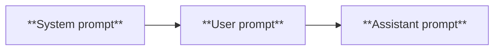

# 今天学一学week1的内容

摘要写在 more 标记前面。

<!-- more -->

## week 1-1: intro to this course

### the overall challenge for SWEs

- But there is some good news
    
- Students learning CS today have the potential to be an order of magnitude better than I was when I was learning. 
    
- Part of the software engineering identity crisis is about asking ourselves what it really means to be a developer?
    
- If your only value add is knowing how to copy-paste from Stackoverflow then you will be replaced by AI
    
- If you think in terms of systems, understand business context, think through resilient architectures and abstractions, AI will strap a rocket to your back in terms of productivity
    
- I promise I will teach you the state-of-the-art in how to use AI in software development today. This will make you irreplaceable
    

### This is not vibe coding

- This is not the vibe coding class. 
    
- Vibe coding has different definitions but the standard one of just YOLO-ing and tab-accepting AI code is not the focus here
    
- I’ll tell you why: vibe coding is just not good enough to truly build good software. Hard to predict but we’re likely 2-10+ years away from that being a viable way to build robust production-level software
    
- Again this is not a class to teach non-technical users how to not have to hire developers.
    
- This is a class for fairly experienced engineers to truly become 10x engineers
    
别幻想着vibe coding能解决一切，说的就是我。

### The Takeaway

- **Human-agent engineering(人-智能体协作工程)**:把精力放在 AI 还替代不了的技能上——业务理解、当 tech lead(技术负责人)。
- <strong>"LLMs are only as good as you are"</strong>: 好的 **context(上下文)** 才有好的代码;<strong>如果你自己都读不懂你的代码库,LLM 也读不懂</strong>。
- **Read and review a lot of code(大量读和审代码)**:培养"品味(taste)",学会分辨好代码与坏代码。
- **Experiment aggressively(大胆试验)**:这个领域<strong>还没有成熟的软件范式(no established patterns yet)</strong>,大家都在摸索。

### How LLM works

Too basic, I already learnt in ECE364.

 token预测的贝叶斯公式揭示了为什么上下文长度这么重要。当然这也是这整门课唯一的公式。
 
自注意力机制，参考transformer论文，链接待补充。

LLM训练流程。

- **Stage 1 — Self-supervised pretraining(自监督预训练)**:在海量公开数据(Common Crawl、Wikipedia、StackExchange、公开 GitHub 仓库)上学"语言和代码长什么样",规模是<strong>千亿到万亿+ token</strong>。此时你说"写个 for 循环",它只会续写出"可能出现在某段代码里"的东西。
- 
- **Stage 2 — Supervised finetuning(监督微调,SFT)**:用几万到几十万条<strong>高质量的"指令-回答"对</strong>教它**听懂指令**。现在你说"写个 for 循环",它知道"哦,你要我给你一个 for 循环"。
- 
- **Stage 3 — Preference tuning(偏好微调)**:用人类对同一问题的多个回答的偏好对比,训练一个 **reward model(奖励模型)**,让输出更符合人类偏好(有用、正确、可读)。现在它会给你 `for idx in range(10):` 这种地道的代码。
- 
- **Slide 18 — Reasoning models(推理模型)**:再往上,用 **chain-of-thought(思维链)** 的推理轨迹、工具调用、对推理步骤的强化学习(RL),让模型学会"想一步、回溯、再想"。


### 实战优缺点

- **Strengths(强项)**:专家级代码补全、代码理解、代码修复。
- **Limitations(局限)**:
    - **Hallucinations(幻觉)**:编造不存在/过时的 API——slides 明确说,这要靠**稳健的 context engineering(上下文工程)** 来缓解。
    - **Context window limits(上下文窗口限制)**:约 100–200K token,而且<strong>"不是每个 token 都同等重要"</strong>(越长越容易丢中间信息)。
    - **Latency(延迟)**:每次请求几秒到几分钟,要据此规划和拆分任务。
    - **Cost(成本)**:最好的模型,输入约 $1–3 / 百万 token,输出 $10+ / 百万 token。


## Week 1-2: LLM Power Prompting

prompting其实是在给LLM编程，是驱动LLM的通用语（lingua franca）。

在 llm-wiki 里,prompt 模板就是"业务逻辑代码"。

??? note "疑问：为什么不用LLM去写prompt？2026年了还有人教prompt engineering？"
    下文的A\ prompt改进器？
    [Claude's system prompt](https://claude.ai/public/artifacts/6e8ffdf3-3faa-4b43-ba76-4c789568e368)

### Self-consistency Prompting(自一致性)

**多次采样**(通常配合 CoT),然后**取最常见的结果(majority vote / 多数表决)**。原理是一种 **model ensembling(模型集成)**:通过采样多条不同的推理路径,把偶发的错误/幻觉投票投掉。slide 13 的例子是:同一个 `IndexError` 让模型分析 5 次根因,取多数结论。

> 工程直觉:这相当于"让模型自己开会投票"。代价是 5 倍的调用成本和延迟,所以用在"对正确性要求高、值得花钱"的地方。


### Tool Use(工具调用)

让 LLM **把它搞不定的事,委托给一个外部系统**。slides 把它定性为<strong>"减少幻觉、实现 LLM 自主性最重要的技巧之一"</strong>。slide 15 的例子:修完 IndexError 后,给模型一组可用工具(用 `<tools>` 标签列出 `pytest` 命令),让它自己跑测试验证。

为什么治幻觉?因为模型不再"凭记忆瞎猜 API 行不行",而是真去调一个工具拿到真实结果。


```
Fix the IndexError. Ensure the CI tests still pass once you have made the fix. Here are the available tools. 

<tools>

pytest -s /path/to/unit_tests

pytest -v /path/to/integration_tests

</tools>

```


### Retrieval Augmented Generation(检索增强生成,RAG)

**给 LLM 注入上下文数据**。好处 slides 列了四条:

1. **保持最新**:不用重训模型就能让它知道新知识,迭代更快。
2. **可解释 + 引用(interpretability and citations)免费送**:答案能标注来源。
3. **减少幻觉**。

```
I want to extend the UserAuthService class to check that the client provides a valid OAuth token. 

Here is how the UserAuthService works now:  
<code_snippet>
def issue_oauth_token():
			….
</code_snippet>

Here is the path to the requests-oauthlib documentation:  
<url>
https://requests-oauthlib.readthedocs.io/en/latest/
</url>

```

### Reflexion(反思)

让 LLM **对自己的输出做反思**。机制是:执行一个动作、观察环境反馈后,把"口头反馈"重新塞回上下文,让它修正。

- 典型做法:在 prompt 后面加一句后缀——<strong>"现在批判你自己的答案。它对吗?如果不对,解释为什么,然后再试一次。"</strong>
- 本质是 **multi-turn prompting(多轮提示)**:第一轮模型先试一版;第二轮你问"对吗?反思并修订"。
- slide 19 的例子用 **observe(观察)→ reflect(反思)→ extend prompt(扩展提示)** 的循环修一个 `JSONDecodeError`。


### 三种角色(System / User / Assistant)

这几页讲 LLM 对话的三个**角色(role)**,你必须分清,因为你代码里天天在用:

- **System prompt(系统提示)**:给 LLM 的**第一条消息**,通常用户看不到。负责设定**人设(persona)、输出规则、风格**。
- **User prompt(用户提示)**:人类**实际的提问/指令**——前面所有例子都是。
- **Assistant(助手)**:LLM **实际生成的内容**。

[Claude's system prompt](https://claude.ai/public/artifacts/6e8ffdf3-3faa-4b43-ba76-4c789568e368)
非常长，**Almost like a loosely followed Isaac Asimov’s 3 laws of robotics**




### Best Practices(最佳实践)

这是把六个技巧落地的操作守则:

- **Slide 25**:可以用 Anthropic 官方的 **prompt improver(提示改进器)** 自动优化 prompt;判断 prompt 清不清楚有个土办法——<strong>"把它给一个上下文很少的人看,如果他困惑,LLM 也会困惑"</strong>;**大胆使用 role prompting(角色提示)** 强化 system prompt。
- **Slide 26 / 28**:两个 role prompting 的对比例子——"你是一个资深工程师水平、详尽又较真的助手" vs. "你是个 Gen Z 数字闺蜜,永远像凌晨两点在 Snapchat 上发消息"。同一个模型,人设一换,输出风格完全不同。
- **Slide 29**:<strong>prompt 要有结构(format with structure)</strong>,用 `<log>`、`<error>` 这样的标签把日志和堆栈分块。
- **Slide 30**:**明确说清楚你要什么**(语言、技术栈、库、约束),并且**拆解任务(decompose tasks)**。


[A\ prompt improver](https://docs.anthropic.com/en/docs/build-with-claude/prompt-engineering/prompt-improver)

prompt 结构；
```
Here are the logs:  
<log>  
LOG MESSAGE

<log> and the stack trace:  
<error>  
STACK TRACE  
<error>
```


## Readings

