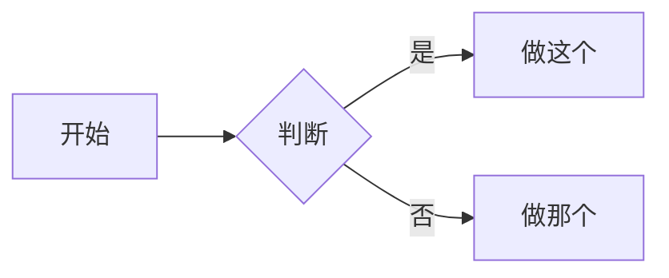

# 功能速查表

忘了某个东西怎么写时看这页。每节先给**源码**，再给**实际效果**。

---

## 1. 折叠块（展开解释专有名词）

源码：

````markdown
??? note "展开：术语解释标题"
    缩进进去的内容默认折叠，点标题才展开。
````

效果：

??? note "展开：术语解释标题"
    缩进进去的内容默认折叠，点标题才展开。

把 `???` 换成 `???+` 则默认就是展开状态。

---

## 2. 提示框（admonition）

源码：

````markdown
!!! tip "小标题（可省略）"
    这是一个提示框。
````

效果：

!!! tip "小标题（可省略）"
    这是一个提示框。

常用类型：`note` `tip` `warning` `danger` `info` `example` `quote`。

!!! warning
    这是 warning。

!!! danger
    这是 danger。

---

## 3. 代码块（参考代码，不需运行）

源码：

`````markdown
```python
def hello():
    print("hi")   # (1)
```

1.  这是代码注释气泡，鼠标点数字会展开。
`````

效果：

```python
def hello():
    print("hi")   # (1)
```

1.  这是代码注释气泡，鼠标点数字会展开。

行内代码用反引号：`like_this`。

---

## 4. 多方案切页（tabbed）

源码：

````markdown
=== "方案 A"
    A 的内容
=== "方案 B"
    B 的内容
````

效果：

=== "方案 A"
    A 的内容
=== "方案 B"
    B 的内容

---

## 5. 复选框（尝试完打勾）

源码：

````markdown
- [x] 已完成 ·（2026-06-07）
- [ ] 待办
````

效果：

- [x] 已完成 ·（2026-06-07）
- [ ] 待办

---

## 6. 数学公式

行内：源码 `\( a^2 + b^2 = c^2 \)`，效果 \( a^2 + b^2 = c^2 \)。

整行：

````markdown
\[
\sum_{i=1}^{n} i = \frac{n(n+1)}{2}
\]
````

效果：

\[
\sum_{i=1}^{n} i = \frac{n(n+1)}{2}
\]

---

## 7. 脚注（时间溯源 / 出处）

源码：

````markdown
这句话有出处。[^note]

[^note]: 这里写出处，比如视频 12:34 或 slides 第 8 页。
````

效果：

这句话有出处。[^note]

[^note]: 这里写出处，比如视频 12:34 或 slides 第 8 页。

---

## 8. 流程图（mermaid）

源码：

`````markdown

`````

效果：


---

## 9. 标签（让页面可被分类检索）

在文件**最顶部**写 frontmatter：

````markdown
---
tags:
  - xv6
  - 并发
---
````

所有用到的标签会自动汇总到[标签索引](../tags.md)。

---

## 10. 开启评论

在想开评论的页面顶部 frontmatter 加一行：

````markdown
---
comments: true
---
````

（前提：你已按使用说明配好 giscus。不写这行的页面就没有评论。）

---

## 11. 写一篇日志（blog）

在 `docs/blog/posts/` 下新建文件，顶部写：

````markdown
---
date: 2026-06-07
categories:
  - 开发日志
---

# 标题

摘要写在 more 标记前面。

<!-- more -->

正文。
````

`categories` 建议固定几类：`科研日记`、`开发日志`、`每日阅读`。
