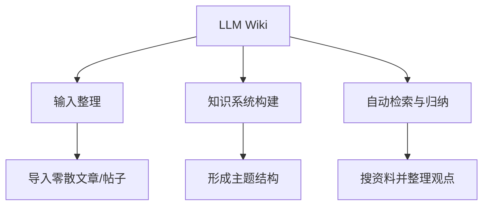

# LLM Wiki 开发进度

> 整个架构是可延拓的：每个模块下写清楚"可尝试的方法论"，每次尝试做记录、打勾、记时间。

## 整体架构（会随进展扩充）

## 模块一：输入整理

把脑子里和收藏夹里零散的东西先喂进来、去重、归类。

可尝试的方法论：

- [x] 手动导入一批知乎文章做样本 ·（2026-06-07）
- [ ] 试 embedding 聚类自动分组
- [ ] 试按"主题—子主题"两级人工 + 机器混合归类

## 模块二：知识系统构建

把整理后的输入连成有结构的知识。

- [ ] 定义主题之间的关系（前置/相关/对立）
- [ ] 试自动抽取每篇的核心观点

## 模块三：自动检索与归纳

- [ ] 设计"重要性评分"的方法论（做到这一步时再参考外部新闻项目的思路）
- [ ] 试自动搜资料补全某个主题

!!! note "怎么用这一页"
    每开一个新尝试，就在对应模块下加一行 `- [ ] 描述`，做完改成 `- [x]` 并在后面括号里记日期。页面底部的"更新时间"会由 git 自动维护。
