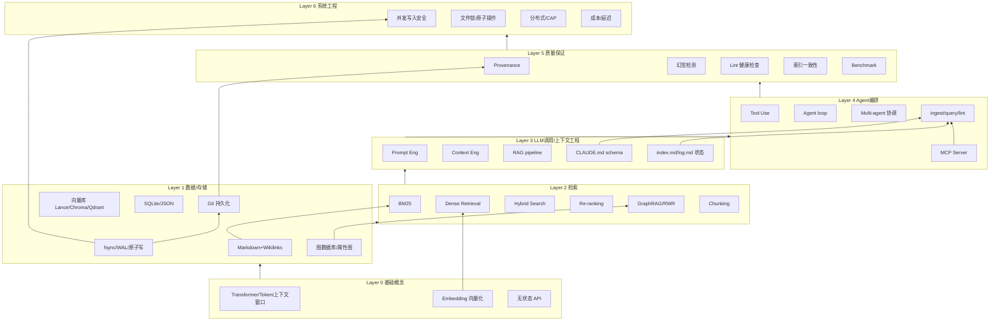

# 从零实现 LLM Wiki：系统性技术学习路线

## TL;DR
- **核心结论**：实现一个 Karpathy 式 LLM Wiki 的"最小可用版本"门槛极低——它本质上就是「不可变的 raw/ 源 + LLM 维护的 markdown wiki/ + 一份 CLAUDE.md schema + ingest/query/lint 三个操作」，用 Claude Code 几小时即可跑通，无需向量库；真正的深度与护城河在于**当知识库变大、需要并发写入、需要可靠检索与质量保证时所暴露的系统工程问题**。
- **学习路线**：建议按「先跑通最简版（0-2 周）→ 加检索与质量保证（2-8 周）→ 攻并发/持久化/Benchmark 系统层（2-6 月）」三阶段推进；OS 知识（fsync、WAL、flock、原子写）对**单机小型 wiki 是低优先级**，但当你引入"多 agent 并发写入 + 崩溃恢复"时变成高 ROI。
- **vibe coding 不等于学不到东西**：关键是把 AI 当"会写代码的同事"而非"黑盒答案机"——用"先自己提出假设→让 AI 当苏格拉底式挑战者→手写关键模块→拆解逆向 AI 代码"的循环，配合间隔重复内化概念。纯"调 API + prompt"护城河上限很低（会被基础模型直接吞掉），向下走系统工程 / 检索算法 / 微调才是深度方向。

---

## 目录
1. A. ARIS（Auto Claude Code Research in Sleep）的 Wiki 架构分析
2. B. 按构建层级分类的技术清单（Layer 0–6）
3. 技术关系图（Mermaid）
4. 学习优先级矩阵
5. 思维导图式学习路线（分阶段）
6. C. 护城河与深度问题
7. D. Vibe Coding 环境下如何真正学到东西
8. E. OS/系统知识与 LLM Wiki 持久化的关系
9. F. Benchmark 问题
10. 参考与来源

---

## A. ARIS 的 Wiki 架构分析

ARIS（Auto-Research-In-Sleep，仓库 wanshuiyin/Auto-claude-code-research-in-sleep，约 11.7k stars，配套技术报告 arXiv:2605.03042）是一套**纯 Markdown 的 Claude Code skill 集合**，目标是"让 Claude Code 在你睡觉时自动做 ML 科研"。它的"Research Wiki / Persistent Research Memory"是 Karpathy LLM Wiki 思想在"科研记忆"场景的落地。

**它的持久化记忆是什么设计？**
- 根目录为 `research-wiki/`，通过 `/research-wiki init` 创建。
- 跟踪**四种实体（entity types）**：papers（论文）、ideas（想法）、experiments（实验）、claims（论断），存为带 canonical node ID 的结构化 Markdown 页面。
- **八种 typed relationship（构成轻量知识图谱）**，arXiv 报告原文为："Eight typed relationships (extends, contradicts, addresses_gap, inspired_by, tested_by, supports, invalidates, supersedes) form a lightweight knowledge graph." 例如 idea --inspired_by--> paper、experiment --supports/invalidates--> claim、paper --supersedes--> paper。
- 关键设计是**保留被否决的想法**："Failed ideas become a banlist; validated claims become foundations for the next ideation round, converting one-shot research into spiral learning."（失败 idea 变禁令清单，验证过的 claim 变下一轮基础，把一次性研究变螺旋式学习）。
- 子命令：`init / ingest / query / lint / stats`。`query` 会重建一个 `query_pack.md`（上限约 8000 字符）的压缩摘要喂给 `/idea-creator`。
- **file-system-as-state（文件系统即状态）**：所有会话状态放在可版本化的纯文本文件里，而非内存缓存或外部数据库；配合 checkpoint-based recovery。

**用了哪些技术？**
- 辅助脚本 `tools/research_wiki.py`（纯 Python 标准库、无依赖，约 767 行），暴露 canonical `ingest_paper` API，采用 `.aris/tools/ → tools/ → $ARIS_REPO/tools/` 的三层 resolver chain。
- "sleep 时的任务调度"本质是**自主夜间研究循环**（plan/draft/对抗审/迭代/持久化），靠 wiki 在多次会话间保持状态。
- `/meta-optimize` 自进化：用 Claude Code hooks 被动记录每次 skill 调用、工具调用、失败、参数覆盖到 `.aris/meta/events.jsonl`，积累 ≥5 次完整运行后分析并提出对 SKILL.md 的**最小 diff 补丁**，经 GPT 跨模型 reviewer 审查 + 用户批准后才应用。它只优化"框架"（SKILL.md/默认参数/收敛规则），**不优化研究产物本身**。
- **跨模型评审**：Claude Code 做 executor（执行），外部 GPT/Codex（GPT-5.5 xhigh）经 MCP 做 critical reviewer；论点是"自审是 stochastic、跨模型审是 adversarial，更难被钻空子"。claim 只有通过跨模型审计（experiment-audit → result-to-claim → paper-claim-audit 三级级联）才能"硬化"成 wiki 事实——其设计原则原文是"a loop can DRIVE, it cannot ACQUIT"（循环只能驱动、不能裁定）。

**与 Karpathy LLM Wiki 的差异与启发**：
- Karpathy 版是**通用个人知识库**（raw→wiki→schema 三层，ingest/query/lint 三操作，刻意保持抽象、模块化、可选）；ARIS 是**垂直科研场景**的实例化，额外加了 typed edges、claim 状态机、跨模型审计、自进化外循环。
- 启发点：① 用 typed edges 把"矛盾/支持/取代"变成可查询结构，而非散落在散文里；② 把"失败/否决"也作为一等公民记忆（anti-repetition）；③ 用独立的第二个模型做"四眼审查"提升可信度；④ 用 hooks 被动采集运行数据来自我改进 schema。

> 注：arXiv 报告把 reviewer 默认模型写作 GPT-5.4，而当前 README/运行时默认已于 2026-05-14 升级为 GPT-5.5，属论文与活仓库的版本差，非矛盾。

---

## B. 按构建层级分类的技术清单

> 每个条目：名称（中英）→ 原理（类比）→ LLM Wiki 应用场景 → 效果评价 → 复现步骤 → 学习资源

### Layer 0 — 基础概念层（LLM 工作原理）

#### Transformer 架构 / Transformer Architecture
- **原理（类比）**：像一个"会议室里所有人同时互相看一眼再发言"的机制——每个 token 通过 self-attention 同时关注序列里所有其他 token，按相关性加权后预测下一个词。它是一个"自回归"的下一个 token 预测器。
- **LLM Wiki 应用**：理解为什么 wiki 的 ingest 本质是"把源文档压进上下文→模型预测出摘要 token"；理解上下文窗口为何是硬约束。
- **效果评价**：是所有现代 LLM 的底座；Karpathy 反复强调 LLM 是"人类文本的有损压缩 + 类人心理"。
- **复现步骤**：跟 Karpathy 的 "Let's build GPT" 视频，用 Claude Code 让它陪你逐行实现 nanoGPT；命令：`git clone https://github.com/karpathy/nanoGPT && 让 Claude Code 解释每个模块`。
- **学习资源**：Karpathy《Let's build GPT from scratch》(YouTube，英文，中等)；《The Illustrated Transformer》(Jay Alammar，英文，入门)；李宏毅机器学习课（中文，入门）。

#### Token / 上下文窗口 / Token & Context Window
- **原理（类比）**：token 是模型的"音节"，上下文窗口是它的"工作记忆桌面"——桌子就那么大，放不下就得取舍。GPT-2 约 1000 tokens，现代模型已到数十万至百万级。
- **LLM Wiki 应用**：这是 Karpathy gist 评论区辩论"用上下文 vs 用 RAG"的核心——评论者 Shilren 给出经验阈值：小于约 5万–10万 token（约 150–200 页）时，直接把整个 wiki 塞进上下文比 RAG 更简单更可靠（100% 检索可靠性、近零基建）；几百万 token 以上才必须用 RAG；中间用 hybrid。
- **效果评价**：上下文不是越长越好，存在"context rot"（召回随 token 数增长而下降）。
- **复现步骤**：让 Claude Code 写脚本统计你 wiki 目录的总 token 数（用 tiktoken），判断是否还在"纯上下文"区间。
- **学习资源**：Anthropic《Effective context engineering for AI agents》(英文)；CS146S Week 1（英文）。

#### Temperature / Top-p（采样参数）
- **原理（类比）**：temperature 像"创意旋钮"——低温=保守复读、高温=天马行空；top-p 是"只在概率累积到 p 的候选词里抽签"。
- **LLM Wiki 应用**：ingest/lint 这类需要忠实、可复现的操作应低温；头脑风暴式 query 可适当升温。
- **效果评价**：对事实型知识库，低温 + 结构化输出能显著降低胡编。
- **复现步骤**：同一个 ingest prompt 分别用 temperature 0 和 1 跑 5 次，对比摘要一致性。
- **学习资源**：OpenAI/Anthropic API 文档（英文，入门）。

#### Embedding（向量化）/ Embedding
- **原理（类比）**：把每段文字变成一个"在语义地图上的坐标"，意思相近的点距离近——于是"找相似"变成"找最近邻"。
- **LLM Wiki 应用**：当 wiki 大到无法全放进上下文时，用 embedding 做语义检索（Dense Retrieval）。
- **效果评价**：是 RAG 的基础，但对 100 篇源、数百页的中小 wiki 往往是过度工程。
- **复现步骤**：用 Claude Code + `sentence-transformers` 把 wiki 每页编码，做一次最近邻查询。
- **学习资源**：Cohere/OpenAI embedding 文档（英文）；BEIR 论文（英文，进阶）。

#### 无状态 API 调用机制 / Stateless API
- **原理（类比）**：每次调 LLM API 都像"第一次见面的失忆症患者（anterograde amnesia，《记忆碎片》）"——它不记得上次对话，全部上下文必须每次重新喂。
- **LLM Wiki 应用**：这正是 LLM Wiki 存在的根本理由——把"记忆"外化到磁盘上的 markdown，每次会话重新加载。
- **效果评价**：Karpathy 把它列为 LLM 三大缺陷之一（幻觉、锯齿状智能 jagged intelligence、无持久记忆）。
- **复现步骤**：连续两次 API 调用，第二次问"我刚才说了什么"，观察它不知道。
- **学习资源**：Karpathy《Software Is Changing (Again)》(YC，英文)。

### Layer 1 — 数据/存储层

#### Markdown + Wikilinks 存储模式
- **原理（类比）**：把知识库做成"互相挂超链接的便签墙"，`[[页面名]]` 就是便签之间的线——这堆互链的 markdown 页面本身就是一张图。
- **LLM Wiki 应用**：Karpathy 架构的 wiki 层核心载体；配 Obsidian 做"IDE"，graph view 看连接结构（Karpathy 原文："Obsidian is the IDE; the LLM is the programmer; the wiki is the codebase."）。
- **效果评价**：Karpathy 评论区共识——对中小规模（约 100 源、数百页）这套就够，无需 embedding 基建；纯文本可 git 版本化、可 grep。
- **复现步骤**：建 `raw/ wiki/ CLAUDE.md`，把 Karpathy gist 全文贴给 Claude Code，让它实例化目录结构和 schema。
- **学习资源**：Karpathy llm-wiki gist（英文，入门）；Obsidian 文档（中英，入门）。

#### Git 版本控制作为持久化机制
- **原理（类比）**：git 是"带时光机的存档系统"——每次提交都是一个可回溯的快照，分支让你并行尝试。
- **LLM Wiki 应用**：wiki 就是一个 markdown 的 git repo，免费获得历史、分支、协作、溯源（每条 claim 可追到某次 commit）。
- **效果评价**：评论区 watsonrm 指出：git merge 只解决**文本冲突**，解决不了**语义重复**（两个 agent 用不同措辞写同一事实，git 会干净地各自合并、留下重复），所以还需 grep 去重 + append-only。
- **复现步骤**：`git init wiki/`，每次 ingest 后 commit；试着用两个分支分别 ingest 不同源再 merge。
- **学习资源**：Pro Git（中英文，入门）；JYY OS 数据库/持久化章节（中文，进阶）。

#### 向量数据库（LanceDB / Chroma / Qdrant）
- **原理（类比）**：embedding 的"专用仓库 + 最近邻索引引擎"，能在百万级向量里毫秒级找相似。
- **LLM Wiki 应用**：wiki 超过上下文容量后的语义检索后端。
- **效果评价**：社区经验——**Chroma** 上手最简单、是新项目默认；**LanceDB** 嵌入式、无需起服务、适合本地/边缘、大语料磁盘效率好（Midjourney 在用）；**Qdrant** 性能与元数据过滤强、适合生产规模 RAG。一篇社区基准给出 Qdrant(HNSW) 查询约 20–30ms / Recall@1 约 95%，LanceDB(IVF_PQ) 约 40–60ms / 约 88%（注：单一来源、非权威，仅供方向参考，应以 VectorDBBench 自测为准）。
- **复现步骤**：`pip install lancedb`，让 Claude Code 把 wiki 编码进 LanceDB 并做一次 query。
- **学习资源**：各自官方文档（英文）；VectorDBBench（开源基准，英文）。

#### 图数据库（Neo4j / 属性图）
- **原理（类比）**：把知识存成"节点+带类型的边"，查询变成"在关系网里走路"。
- **LLM Wiki 应用**：当你想把 wikilinks 升级成 typed edges（contradicts/supports/extends），属性图是天然载体（ARIS、Dense-Mem 都用了 typed 关系）。
- **效果评价**：Karpathy 评论区 pursultani 指出，bare `[[page]]` 是无类型边，表达不了"矛盾/支持/取代"——属性图或 YAML frontmatter relationship block 才能；并提醒 contradicts 边在人文等"对话性"领域应被**保留**而非当 lint 缺陷清除。
- **复现步骤**：用 Neo4j Desktop 或在 markdown frontmatter 里写 `relates_to: [{page, rel}]`，用 Obsidian Dataview 查询。
- **学习资源**：Neo4j 官方教程（英文）；Karpathy gist 评论区 pursultani 的 typed-edge 方案（英文）。

#### KV 存储（SQLite / JSON）
- **原理（类比）**：SQLite 是"一个文件就是一个数据库"的轻量关系存储；JSON 是最朴素的键值落盘。
- **LLM Wiki 应用**：存索引、日志、provenance 元数据（源 hash、时间戳、成本）；qmd 就用 SQLite + sqlite-vec 做本地检索。
- **效果评价**：SQLite 是单机持久化的"瑞士军刀"，自带 WAL 模式保证崩溃一致性。
- **复现步骤**：让 Claude Code 用 SQLite 给 wiki 建一张 `pages(path, summary, source_hash, updated_at)` 表。
- **学习资源**：SQLite 官方文档（英文）；JYY OS《数据库系统》lect27（中文）。

#### 文件系统与 OS 持久化原理（fsync / WAL / 原子写）
- **原理（类比）**：你以为 `write()` 写完就安全了，其实数据还躺在"操作系统的传话筒（page cache）"里；`fsync()` 才是真正按下"存盘键"。WAL 是"先把要做的事记到流水账，再慢慢做"，崩溃后照流水账重放。
- **LLM Wiki 应用**：agent 写 wiki 页面崩溃/断电时，避免半截文件、避免丢更新。
- **效果评价**：danluu《Files are hard》指出——`rename` 在崩溃语义下**不保证原子**；正确的"持久替换"必须 ①写临时文件 ②`fsync(temp)` ③`rename(temp,target)` ④`fsync(父目录)`，少一步都可能丢。
- **复现步骤**：让 Claude Code 实现一个 `atomic_write(path, data)` 走上面四步；故意在 rename 前 kill 进程，验证旧文件完好。
- **学习资源**：danluu《Files are hard》(英文，进阶)；JYY OS《文件系统实现》lect26（中文，进阶）。

### Layer 2 — 检索层

#### BM25（关键词检索）
- **原理（类比）**：升级版"Ctrl+F"——按词频/逆文档频率给文档打分，罕见词命中加分多。
- **LLM Wiki 应用**：精确匹配专有名词、ID、代码符号；qmd 默认就用 BM25。
- **效果评价**：对精确关键词查询往往打败向量检索，是 hybrid 的必备一半。
- **复现步骤**：`qmd collection add ~/wiki --name wiki; qmd search "关键词"`。
- **学习资源**：qmd README（英文）；BEIR 论文（英文，进阶）。

#### Dense Retrieval（向量语义检索）
- **原理（类比）**：用"语义坐标最近邻"找意思相近而非字面相同的内容。
- **LLM Wiki 应用**：处理"换了说法"的查询（同义、概念检索）。
- **效果评价**：擅长语义、弱于精确匹配（专名/数字易漏）。
- **复现步骤**：`qmd vsearch "概念问题"`。
- **学习资源**：qmd 文档；Sentence-Transformers 文档（英文）。

#### 混合检索（Hybrid Search）
- **原理（类比）**：BM25 管"字面"、向量管"语义"，用 RRF（Reciprocal Rank Fusion，k=60）把两份排名融合。
- **LLM Wiki 应用**：Karpathy gist 直接推荐的 qmd 就是 hybrid（BM25+向量+LLM 重排，全本地，由 Tobi Lütke 开发，MIT 许可）。
- **效果评价**：社区普遍认为 hybrid 在多样查询上稳定优于单一方法，不显著损精度。
- **复现步骤**：`qmd query "问题"`（触发 hybrid + rerank）。
- **学习资源**：qmd 架构图（英文）；Anthropic Contextual Retrieval（英文）。

#### Re-ranking（重排序）
- **原理（类比）**：初筛拿回 30 个候选后，让一个更"较真"的模型逐个判断"这个到底相不相关"再重排。
- **LLM Wiki 应用**：query 操作的最后一道精排，提升 top-k 质量。
- **效果评价**：qmd 用 position-aware 融合（rank1-3 信检索 75%，rank11+ 信 reranker 60%）。
- **复现步骤**：用 qmd query 观察 rerank 前后排名变化。
- **学习资源**：qmd README；Cohere Rerank 文档（英文）。

#### GraphRAG 与 Random Walk with Restart (RWR)
- **原理（类比）**：先把语料抽成知识图谱、用 Leiden 算法聚成"社区"并生成社区摘要，回答全局问题时综述这些摘要；RWR 是"从起点随机游走、时不时跳回起点"，给图上节点算相关性。
- **LLM Wiki 应用**：回答需要跨多页综合的"全局问题"（standard RAG 易漏）；与 wiki 的 typed-edge 图天然契合。
- **效果评价**：据 Microsoft Research Edge et al.《From Local to Global: A Graph RAG Approach to Query-Focused Summarization》(arXiv:2404.16130)，GraphRAG 在 comprehensiveness 上 win rate 72–83%、diversity 62–82%（vs 朴素 vector RAG 仅 22–32% / 18–28%），且 root-level 摘要少用 97% tokens；但官方警告 indexing 成本高，先小规模试。
- **复现步骤**：`pip install graphrag`，用小语料（如 Paul Graham 文集）跑官方 quickstart。
- **学习资源**：microsoft.github.io/graphrag（英文）；DataCamp GraphRAG 教程（英文）。

#### Chunking 策略
- **原理（类比）**：把长文切成"刚好一口能吃下"的块——切太小丢上下文，切太大稀释信号、切错边界毁语义。
- **LLM Wiki 应用**：把 raw 源切块再 embedding；LLM Wiki 模式下若走纯上下文则可少切甚至不切。
- **效果评价**：社区共识——recursive（512 token、按段/行/词递归切）是务实默认；semantic 切更准但块数多、索引变大；务必用 token 而非字符计数（LangChain `RecursiveCharacterTextSplitter` 默认按字符计，应改用 `.from_tiktoken_encoder()`）。
- **复现步骤**：让 Claude Code 用 RecursiveCharacterTextSplitter 对一篇长文切块并打印边界。
- **学习资源**：Redis/Pinecone chunking 指南（英文）；各 chunking 综述博客（英文）。

### Layer 3 — LLM 调用与上下文工程层

#### Prompt Engineering 基础
- **原理（类比）**：把任务说清楚的"提问的艺术"——few-shot 给范例、chain-of-thought 让它"打草稿"、role prompting 给它人设。
- **LLM Wiki 应用**：写 ingest/query/lint 的指令；CLAUDE.md 里的工作流约定。
- **效果评价**：CS146S 指出"prompt 是新的源代码"，应像源码一样版本化；并强调要找"the right altitude"——既不过度硬编码 if-else、也不过度笼统。
- **复现步骤**：对同一 ingest 任务，对比"裸 prompt"和"few-shot + CoT"的输出质量。
- **学习资源**：Anthropic Prompt Engineering 指南（英文）；《The Prompt Report》综述（英文）。

#### Context Engineering（vs Prompt Engineering）
- **原理（类比）**：prompt engineering 管"怎么问"，context engineering 管"模型回答时该看到哪些信息"——后者是把知识放进"基础设施"而非单条指令。Anthropic 原文："context engineering refers to the set of strategies for curating and maintaining the optimal set of tokens (information) during LLM inference."
- **LLM Wiki 应用**：决定每次 query 时把哪些 wiki 页面、index、log 放进上下文；这正是 LLM Wiki 的精髓。
- **效果评价**：Anthropic 视其为 prompt engineering 的自然演进；存在三种失败模式——信息不足→幻觉、过量→注意力涣散、冲突→输出随检索顺序漂移。
- **复现步骤**：让 Claude Code 实现"先读 index.md 找相关页→只加载这几页"的 just-in-time 上下文装配。
- **学习资源**：Anthropic《Effective context engineering for AI agents》(英文)；Elastic context engineering 博客（英文）。

#### RAG pipeline 完整流程
- **原理（类比）**：开卷考试流程——query→检索相关页→塞进上下文→生成带引用的答案。
- **LLM Wiki 应用**：query 操作的标准实现（但 Karpathy 强调 wiki 是"预编译"的，不必每次从 raw 重新检索；他原话是 RAG 模式下"the LLM is rediscovering knowledge from scratch on every question. There's no accumulation."）。
- **效果评价**：properly implemented RAG 据多篇 2025 基准可降幻觉，但据 Stanford RegLab/HAI 的 Magesh et al.《Hallucination-Free? Assessing the Reliability of Leading AI Legal Research Tools》(Journal of Empirical Legal Studies, 2025-04-23; arXiv:2405.20362)，即便专用法律 RAG 工具仍幻觉 17–33%（Lexis+ AI 17%、Westlaw AI-Assisted Research 33%，对照 GPT-4 为 43%）——"while RAG appears to improve the performance... the hallucination problem persists at significant levels"。
- **复现步骤**：用 Claude Code 串起"检索→拼上下文→生成+引用"最小 pipeline。
- **学习资源**：CS146S Week 1 RAG 部分（英文）；RAGAS 文档（英文）。

#### System Prompt / CLAUDE.md 模式
- **原理（类比）**：给 AI 的"员工手册 + SOP"——把它从"聊天对象"变成"严格执行流程的引擎"。
- **LLM Wiki 应用**：Karpathy 架构的 schema 层；告诉 LLM 目录怎么组织、ingest/query/lint 怎么走。Karpathy 原文："it's what makes the LLM a disciplined wiki maintainer rather than a generic chatbot."
- **效果评价**：CS146S 称之为"最高杠杆的投资"，但要保持精简（每次都会被前置进上下文消耗预算）。
- **复现步骤**：写一份 CLAUDE.md，包含目录约定、三操作工作流、硬规则（如"绝不编数字"）。
- **学习资源**：CS146S Week 4（英文）；Karpathy gist schema 部分（英文）。

#### 无状态 API 的状态管理模式
- **原理（类比）**：把"记忆"外化——像 ARIS 的 file-system-as-state，所有状态写进可版本化文本文件。
- **LLM Wiki 应用**：index.md（内容目录）+ log.md（append-only 时间线）让无状态会话能"续上"。
- **效果评价**：Karpathy 提示 log.md 用一致前缀（`## [2026-04-02] ingest | Article Title`），可被 `grep "^## \[" log.md | tail -5` 解析。
- **复现步骤**：让 Claude Code 每次操作 append 一行到 log.md，并维护 index.md。
- **学习资源**：Karpathy gist Indexing and logging 部分（英文）。

#### KV Cache（与持久化存储的区别）
- **原理（类比）**：KV Cache 是 Transformer 推理时缓存已算过的 key/value，避免重复计算——它是**推理加速的内存机制**，断电即失，和"把知识存盘"完全两回事。
- **LLM Wiki 应用**：理解它能解释为何长上下文调用更贵/更慢；但它不是你的持久化层（持久化层是磁盘上的 markdown/git）。MemGPT/Letta 的"core/recall/archival"三层记忆才是把 OS 虚拟内存思想搬到 LLM 记忆——core memory 像 RAM（在上下文里）、archival 像冷存储（工具调用查）。
- **效果评价**：常见混淆点——把"上下文/KV cache"当成"记忆"，导致误以为 LLM 会记住。
- **复现步骤**：阅读 Letta 的三层记忆设计，对照"上下文（RAM）vs 磁盘（archival）"。
- **学习资源**：MemGPT 论文 arXiv:2310.08560（英文，进阶）；Letta 博客（英文）。

### Layer 4 — Agent 编排层

#### Tool Use / Function Calling
- **原理（类比）**：给 LLM 配"工具箱"，它能决定"现在该调哪个工具、传什么参数"，再读工具返回继续推理。
- **LLM Wiki 应用**：让 LLM 调用 grep/search/qmd 等工具操作 wiki。
- **效果评价**：工具太多会"context confusion"导致性能下降——要少而精、输出语义化（CS146S：返回 `user: Jane Doe` 而非 `user: A1B2C3D4`）。
- **复现步骤**：用 Claude Code 定义一个 `search_wiki` 工具并让模型调用。
- **学习资源**：Anthropic tool use 文档（英文）；CS146S Week 4（英文）。

#### MCP（Model Context Protocol）服务器设计
- **原理（类比）**：MCP 是"AI 世界的 USB-C 口"——以前每个模型×每个工具都要定制连接器（M×N 问题），MCP 让大家各实现一次协议即可互插（M+N）。
- **LLM Wiki 应用**：把 wiki 搜索（如 qmd）包成 MCP server，让 Claude Code 当原生工具调用；ARIS、Dense-Mem、LLM-WIKI-MCP 都走这条路。
- **效果评价**：Anthropic 于 2024 年 11 月推出 MCP；OpenAI 于 2025 年 3 月 26 日采纳，CEO Sam Altman 在 X 发文："People love MCP and we are excited to add support across our products"（据 TechCrunch 2025-03-26 报道），已成事实标准。三大原语：tools（模型控制）、resources（应用控制）、prompts（用户控制）。注意安全：MCP 有 prompt injection、工具组合泄露、lookalike 工具替换等已知风险。
- **复现步骤**：用 FastMCP（Python SDK）+ MCP Inspector 起一个本地 server 暴露 `search_wiki` 工具。
- **学习资源**：modelcontextprotocol.io 规范（英文）；DeepLearning.AI《MCP: Build Rich-Context AI Apps》(英文)；Anthropic《Code execution with MCP》(英文)。

#### Agent loop（感知-规划-行动-观察）
- **原理（类比）**：像 OODA 循环——观察状态→规划→执行工具→观察结果→再循环，直到达成目标或触发停止条件。
- **LLM Wiki 应用**：ingest/lint 的自动化执行；ARIS 的"critique-to-action loop"默认阈值 6/10、最多 4 轮。
- **效果评价**：要设计明确的收敛/停止条件，否则会"context poisoning"卡死在早期错误上（CS146S 列的四大长上下文失败模式之一）。
- **复现步骤**：让 Claude Code 实现一个"lint→发现问题→修复→再 lint"的有界循环。
- **学习资源**：CS146S Week 3（英文）；ARIS arXiv:2605.03042（英文）。

#### Multi-agent 协调（写入冲突处理）
- **原理（类比）**：多个工人同改一个文档，第二个保存的会覆盖第一个——需要"分工到不同文件 + append-only"让写入天然不冲突。
- **LLM Wiki 应用**：多 agent 并发 ingest 时防丢更新/防重复。
- **效果评价**：评论区 watsonrm 的核心洞见——**single-writer 不是天花板而是"零合并"的最便宜实现；可扩展的多写法是把数据建模成天然可交换（commutative）的 append-only 日志**，让 git 每次都能自动 merge；语义去重（grep citation）是 git 看不见的、必须永久保留的一层。
- **复现步骤**：让两个 Claude Code 会话分别只 append 到各自分区文件，再 merge 验证无冲突。
- **学习资源**：Karpathy gist 评论区 watsonrm/MarcoPorcellato（英文）；JYY OS 并发章节（中文）。

#### Agentic ingest/query/lint 三操作实现
- **原理（类比）**：wiki 的"三个基本动作"——吃进新源（ingest）、回答问题（query）、体检（lint）。
- **LLM Wiki 应用**：整个 LLM Wiki 的操作核心。Karpathy 原文：ingest 一个源"might touch 10-15 wiki pages"；好的 query 答案应回填成新页面让探索复利（"good answers can be filed back into the wiki as new pages"）；lint 查矛盾/过期/孤儿页/缺失交叉引用。
- **效果评价**：评论区已演化出大量扩展——brtrx 的 bias-aware lint（每批 5 个 + 跨会话 scratchpad + 随机顺序消除 ingest 顺序偏差）、synthadoc 的五态页面生命周期（draft→active→stale→contradicted→archived）。
- **复现步骤**：把 Karpathy gist 贴给 Claude Code，让它在你的 CLAUDE.md 里实现三操作工作流并跑一遍 ingest。
- **学习资源**：Karpathy gist Operations 部分（英文）；评论区 brtrx 的 bias-aware lint（英文）。

### Layer 5 — 质量保证层

#### Provenance Tracking（溯源）
- **原理（类比）**：每条结论都贴一张"它从哪来"的标签——源文件、行号、hash、时间戳。
- **LLM Wiki 应用**：让每条 claim 可追到源；ingest 时记源 hash，源变了就标 stale，可跳过未变文件。
- **效果评价**：评论区 synthadoc/Electro-resonance 实现了 SHA-256 hash 失配→标 stale、每段追到源文件名+行号、记录每页编译成本 `ingest_cost_usd`。
- **复现步骤**：让 Claude Code 在每页 frontmatter 写 `source: 文件名#行号` 和 `source_sha256`。
- **学习资源**：synthadoc/secure-llm-wiki 仓库（英文）；ClarityArc citation 文章（英文）。

#### 幻觉检测与缓解
- **原理（类比）**：让模型"自证清白"——多次采样看是否自相矛盾（SelfCheckGPT），或用 NLI 模型验证"答案是否真能从检索内容推出"。
- **LLM Wiki 应用**：ingest 时防把源里没有的内容编进 wiki；lint 时查无依据的 claim。
- **效果评价**：RAG 能降幻觉但不能消除——据 Magesh et al. 2025 实测，专用法律 RAG 工具仍幻觉 17%（Lexis+ AI）至 33%（Westlaw）；"must-cite"规则 + 结构化输出 + 第二模型四眼审查更稳。**警示**：ARIS 论文中那条"GRV 框架降幻觉 43%"的引用本身就是一个被构造出来演示"记忆投毒（memory pollution）"的**虚构论文**案例——提醒你溯源的重要性。
- **复现步骤**：让 Claude Code 对一段生成答案跑 SelfCheckGPT 式的"采样 5 次比一致性"。
- **学习资源**：Vectara HHEM、SelfCheckGPT(EMNLP 2023)（英文）；Stanford 法律 RAG 幻觉研究 arXiv:2405.20362（英文）。

#### Lint 健康检查设计
- **原理（类比）**：给知识库做"定期体检"——查矛盾、过期声明、孤儿页、缺页、缺交叉引用、数据缺口。
- **LLM Wiki 应用**：Karpathy 三操作之一，维持 wiki 随增长而健康。
- **效果评价**：单次全量 lint 会撞上下文上限——brtrx 方案改为每批 5 个 + 跨会话 scratchpad + 随机顺序消除偏差。
- **复现步骤**：让 Claude Code 写一个 lint skill，分批检查并输出问题清单 + 建议补充的新问题。
- **学习资源**：Karpathy gist Lint 部分 + 评论区 brtrx（英文）。

#### 向量/图 vs Markdown 的一致性保证
- **原理（类比）**：markdown 是"真理之源"，向量库/图库是"派生索引"——派生层必须能从源重建，否则就会漂移。
- **LLM Wiki 应用**：源 markdown 改了，要重新 embedding / 更新图边，否则检索到过期内容。
- **效果评价**：常见坑——双写不一致；务实做法是"markdown 为准，索引可随时全量重建"。评论区 MarcoPorcellato 还指出 flat-file 在 agent 后台并发改写时易损坏，故转向 Logseq 块级 AST。
- **复现步骤**：让 Claude Code 写一个"检测 markdown 改动→增量重建索引"的脚本（用 source_sha256 比对）。
- **学习资源**：MarcoPorcellato 的 flat-file mutation 讨论（英文）。

#### Benchmark 设计（现状与替代方案）
- **原理（类比）**：没有现成的"LLM Wiki 跑分卡"，得自己拼一套体检指标。
- **LLM Wiki 应用**：见下文 F 节。
- **效果评价**：几乎无直接 benchmark，可借 RAG（RAGAS/BEIR）、记忆系统（LongMemEval/LoCoMo/Letta Leaderboard）的指标。
- **复现步骤**：见 F 节最小 eval 框架。
- **学习资源**：RAGAS、BEIR、Letta benchmark 博客（英文）。

### Layer 6 — 系统工程层（可选深入）

#### 并发写入安全（append-only / OCC / worktree）
- **原理（类比）**：三种思路——append-only（只追加不改、天然可合并）、OCC（乐观并发，先改后验冲突）、worktree（每个 agent 一个独立工作目录/分支）。
- **LLM Wiki 应用**：多 agent 并发维护 wiki 的核心保障。
- **效果评价**：实测坑——Claude Code 并发起 3+ worktree 子 agent 会争抢 `.git/config.lock` 导致失败甚至丢工作（GitHub issue #34645/#55724：失败 agent 的 worktree 被 auto-cleanup 删除、工作永久丢失）；MarcoPorcellato 用 Logseq 块级 AST + UUID + mmap OCC 锁解决 flat-file 并发损坏。
- **复现步骤**：`git worktree add ../w1 -b agent1`，两个会话分别在各自 worktree 工作再合并；观察 lock 争用。
- **学习资源**：Claude Code issue #34645/#55724（英文）；JYY OS 并发控制 lect13-17（中文）。

#### 文件锁与原子操作（OS 层）
- **原理（类比）**：`flock` 是"门上的锁"——一个 agent 进去就锁门，别人等；原子写见 Layer 1。
- **LLM Wiki 应用**：单机多进程写同一文件时的互斥；`.git/index.lock` 就是 git 的 flock 式机制。
- **效果评价**：watsonrm 提醒——锁是"多写者争同一文件"的症状，按文件分区 + append-only 能让锁消失（更优）。
- **复现步骤**：让 Claude Code 用 Python `fcntl.flock` 实现对 index.md 的写锁。
- **学习资源**：JYY OS 互斥/同步 lect14-16（中文）；danluu Files are hard（英文）。

#### 分布式 agent 一致性（CAP 权衡）
- **原理（类比）**：CAP——一致性、可用性、分区容忍三者最多保二；多机协作 agent 必须取舍。
- **LLM Wiki 应用**：若把 wiki 做成多机/云端多 agent 服务（如评论区 noirblue 的 Foundry 批量编译 + Frontline 交互服务双节点）才需要。
- **效果评价**：对单机个人 wiki 是过度工程；只有规模化才需要。
- **复现步骤**：（进阶）阅读 noirblue Mnemosyne spec 的双节点部署设计。
- **学习资源**：JYY OS 数据中心/并发 lect21（中文）；CAP 经典论文（英文，进阶）。

#### 成本与延迟分析
- **原理（类比）**：每次 LLM 调用都在花钱花时间——要算"每页 ingest 成本、每 query 延迟"。
- **LLM Wiki 应用**：synthadoc 把 `ingest_cost_usd` 写进每页；ARIS 记录每次 LLM 调用的成本/hash。
- **效果评价**：是判断"用上下文 vs RAG"、"本地小模型 vs 云大模型"的关键依据（评论区 synto 支持 per-role provider：本地 Ollama 小模型跑 ingest + 云端大模型跑写作）。
- **复现步骤**：让 Claude Code 在 log.md 记录每次操作的 token 数 × 单价。
- **学习资源**：各家 API pricing 页；synto/synthadoc 仓库（英文）。

---

## 技术关系图（Mermaid）

---

## 学习优先级矩阵

按「对 LLM Wiki 的必要性」×「学习难度」分四象限：

|                 | 低难度                                                                                                      | 高难度                                                                   |
| --------------- | -------------------------------------------------------------------------------------------------------- | --------------------------------------------------------------------- |
| **高必要性（先学）**    | Markdown+Wikilinks、Git、CLAUDE.md/schema、ingest/query/lint、Prompt/Context Engineering、无状态 API、Token/上下文窗口 | RAG pipeline、Hybrid 检索(qmd)、MCP server、幻觉检测/溯源、Lint 设计                |
| **低必要性（后学/按需）** | Temperature/Top-p、SQLite/JSON、BM25 单用、成本核算                                                               | GraphRAG/RWR、图数据库、向量库调优、并发写入安全、fsync/WAL/flock、分布式/CAP、Transformer 内部 |

**推荐学习顺序**：① 高必要性低难度（搭起能跑的最简 wiki）→ ② 高必要性高难度（让它检索好、答得可信）→ ③ 低必要性按你的实际瓶颈选学（wiki 变大→检索/向量库；多 agent→并发/OS；想做产品→成本/Benchmark）。

---

## 思维导图式学习路线（分阶段）

**阶段一（0–2 周）：跑通最简 LLM Wiki**
- 读懂 Karpathy gist 全文 + 看 Karpathy《Software Is Changing》。
- 装 Claude Code + Obsidian；建 `raw/ wiki/ CLAUDE.md`。
- 把 gist 贴给 Claude Code，协作实例化 schema 与目录。
- 手动 ingest 5–10 个源，跑通 query、跑一次 lint；用 git 提交每次变更。
- 学：Markdown/Wikilinks、Git 基础、Prompt/Context Engineering、无状态 API、index.md/log.md 模式。
- **里程碑**：你能对着自己的 wiki 问问题并得到带引用的答案。

**阶段二（2–8 周）：检索 + 质量保证**
- 当 wiki 接近上下文上限时引入 qmd（hybrid 检索 + rerank），包成 MCP server 供 Claude Code 调用。
- 学 chunking、embedding、RAG pipeline、re-ranking。
- 加质量层：provenance（源 hash/行号）、幻觉检测（must-cite + 采样一致性）、bias-aware lint、五态页面生命周期。
- 设计你自己的最小 eval（见 F 节）。
- 学：MCP（DeepLearning.AI 课）、Context Engineering（Anthropic 文）、RAGAS。
- **里程碑**：wiki 上百源仍检索准、答案可溯源、有一套可重复的评测。

**阶段三（2–6 月）：系统工程深入（按需）**
- 多 agent 并发：append-only + 按文件分区 + worktree 隔离 + 语义去重；踩 git lock 坑并解决。
- OS 层：实现 atomic_write（临时文件→fsync→rename→fsync 目录）、用 SQLite WAL 存元数据、flock 互斥。
- 选学 GraphRAG/typed-edge 图、图数据库、成本/延迟优化（per-role provider）。
- 想做"深度/护城河"：往下走系统工程→推理框架→微调（见 C 节）。
- 学：JYY OS 并发(lect13-21)+持久化(lect22-26)+数据库(lect27)。
- **里程碑**：你的 wiki 能在多 agent 并发写入下不丢数据、崩溃可恢复，并有成本/性能数据。

---

## C. 护城河与深度问题：纯应用层够不够深？

**当前 LLM 应用开发者的护城河通常来自哪里？**
- **数据飞轮**：用户交互持续产生专有反馈数据，回灌让系统越用越好（Cursor 的代码补全、Perplexity 的搜索）——竞品没有你的用户就复制不出你的数据集。
- **领域知识 / 垂直深度**：法律、金融、医疗等专有/受监管数据 + forward-deployed 团队把"没写在网上的脏流程"映射进产品（Harvey 据报道 ARR 约 $195M、估值 $8-11B；Palantir）。
- **工作流深度集成 / 切换成本**：深嵌企业流程、6-12 月才能 pilot 完，换供应商等于重做（Cursor 索引整个 repo、多文件事务）。
- **系统工程能力 / 基础设施控制**：模型选择、微调、GPU 成本优化、检索策略——是"渲染管线"级别的硬工程。
- **算法创新**：在检索、记忆、agent 架构上的真创新。

**纯"调 API + prompt 工程"的护城河上限在哪？**
- 极低。多篇 2025-2026 投资/工程分析的共识："prompt 不是专有的，是任何人系统测试就能逆向的文本串"；"能否让技术用户把你的核心 prompt 贴进 ChatGPT 就拿到 80% 输出？能=你就是个 wrapper"。
- 风险：① 被基础模型直接吞掉（新版模型自带你的功能）；② 毛利被 API 涨价挤压（传统 SaaS 70-90% 毛利，wrapper 据业内估算 50-60%，且 OpenAI 2025 年内多次涨价）；③ 大量 wrapper 据业内预测将在 2026 年消亡（一说约 90%）。
- Karpathy 框架印证：Software 3.0 里 LLM 是"操作系统/计算新底座"，"your prompts are now programs that program the LLM"、"the context window is your program, the LLM is the interpreter"——单纯写 prompt 等于在租来的地上盖楼，地主随时拆。

**想"做深"的路径（从应用层向下）：**
1. **系统工程**：把 wiki 做成可靠系统——并发安全、崩溃恢复、成本/延迟优化、可观测性。这是本报告 Layer 6 + OS 知识的价值所在。
2. **检索/记忆算法**：从调 qmd 到自己实现 hybrid+rerank、GraphRAG、typed-memory（MemGPT/Letta 式分层记忆）。
3. **推理框架**：理解 KV cache、批处理、量化、本地推理（Ollama/LM Studio），做 per-role provider 成本优化。
4. **模型微调**：垂直领域 LoRA/微调（注意：Karpathy 评论区 mikhashev 的 52 次实验显示，<10M 参数模型 LoRA 知识注入几乎不可行——top-1 recall 很快归零，需 7B+ 模型才稳定）。
5. **理论研究**：读论文、做评测、甚至像 ARIS/AutoSci 那样让 agent 自己做研究。

**结论（取立场）**：对个人学习者，LLM Wiki 是绝佳的"向下钻"载体——它从纯应用层（贴 gist 给 Claude Code）开始，但每一个"做大/做可靠"的需求都自然把你推向系统工程、检索算法、OS 持久化。护城河不在 prompt，而在你能把这套东西做成**可靠、可溯源、可并发、成本可控**的系统，以及你喂给它的**专有数据 + 领域 schema**。

---

## D. Vibe Coding 环境下如何真正学到东西

**核心原则：把 AI 当"会写代码的同事"，而非"黑盒答案机"。** Karpathy 的"自主性滑块（autonomy slider）"是关键——按任务选择让 AI 多自主，而非全程托管。

**具体方法论：**
1. **理解优先于记忆**：每次 AI 写完代码，先不接受，让它**逐行解释**，你能复述了再合并。CS146S 的核心论点："You won't be replaced by AI. You'll be replaced by a competent engineer who knows how to use AI."——execution 技能被 AI 接管，judgment 技能（分解问题、架构决策、验证）仍是人的。
2. **代码拆解 + 逆向理解**：让 AI 写完后，删掉关键函数让自己手写一遍再对比；或让 AI 给你出"这段代码为什么这样写"的小测验。
3. **手写关键部分**：对核心机制（如 atomic_write 的四步、agent loop 的收敛条件、hybrid 检索的 RRF 融合）坚持自己手敲一遍——这些是"判断力"所在。
4. **苏格拉底式学习（防幻觉投毒）**：采用 Karpathy gist 评论区 Archimondstat 提出的 "Socrates–Plato–Bayes" 法——**先你自己提出假设/解释→让 AI 当挑战者找漏洞/反例→你按贝叶斯式更新→只有经得起挑战的想法才进 wiki**。避免 wiki 沦为"AI 生成但你从未内化的幻觉笔记堆"（他用概率论证：每条笔记幻觉概率非零时，笔记数增长会使"至少一条幻觉"概率趋近 1）。
5. **间隔重复内化概念（Andy Matuschak）**：把学到的关键概念写成 spaced repetition prompts——好 prompt 应"connect and relate ideas"而非孤立细节；"deep understanding requires (and is a result of) intense personal connection"。用 Anki/Orbit 复习 Layer 0-3 的核心概念。
6. **做你在乎的真问题（Richard Hamming《You and Your Research》）**：选一个你真正想积累知识的领域（你的研究、你的爱好）来建 wiki——Hamming 强调做"重要问题"、保持"开放的门"、用复利式努力。真实动机让你愿意钻进原理。
7. **用 prompt 即源代码的纪律**：把你和 AI 协作的关键 prompt/CLAUDE.md 也 git 版本化（CS146S：committing 生成代码却扔掉 prompt 等于"version-controlling the binary"而销毁源码）。

**反模式（会导致学不到）**：全程 YOLO 模式接受所有代码、从不读 diff、从不问"为什么"、把 wiki 当 AI 的垃圾场而非自己思考的结晶。

---

## E. OS/系统知识与 LLM Wiki 持久化的关系

**JYY OS 2026 大纲中与 LLM Wiki 直接相关的模块：**
- **持久化（lect22-27）**：设备与驱动、持久数据存储、文件系统 API、文件系统实现、**数据库系统**——直接对应 wiki 的落盘、原子写、崩溃恢复、SQLite 元数据。最高相关。
- **并发（lect13-21）**：多处理器编程、互斥、同步、并发 Bugs、并行数据结构、异步编程、数据中心并发——对应多 agent 并发写入、文件锁、写入冲突。高相关。
- **虚拟化（lect5-12）**：进程、地址空间、访问 OS 对象、UNIX Shell、C 标准库、链接加载——对应理解"agent 调 shell 工具/进程""文件描述符"等，中相关。其中 lect4 直接是《Scaling Law 和 Agentic AI》、lect8《终端和 UNIX Shell》对理解 Claude Code 这类工具底层很有帮助。

**具体应用场景：**
- **fsync / 原子写**：agent 写 wiki 页时崩溃/断电，避免半截文件。正确做法（danluu《Files are hard》）：写临时文件→`fsync(temp)`→`rename(temp,target)`→`fsync(父目录)`；注意 rename 在崩溃语义下**不原子**，且少了父目录 fsync，重启后 rename 可能丢失。
- **WAL（Write-Ahead Log）**：先把"要写什么"记到流水账再落盘，崩溃后重放——SQLite/Postgres 都靠它做崩溃一致性。LLM Wiki 的 log.md（append-only）就是一个朴素的 WAL 思想体现；可用 SQLite WAL 模式存元数据。
- **flock（文件锁）**：单机多进程写同一文件（如 index.md）时互斥；git 的 `.git/index.lock` 就是这种机制。

**并发 agent 写入崩溃时，OS 层的解决方案：**
- **append-only + 按文件/分区分写**：让并发写天然可交换，git 每次自动 merge（watsonrm 的核心方案，比加锁更优）。
- **worktree 隔离**：每个 agent 独立工作目录/分支，冲突推迟到 merge 时由标准 git 工具检测；但注意 Claude Code 实测 3+ 并发 worktree 会争 `.git/config.lock` 失败（issue #34645/#55724），需串行化或重试退避。
- **OCC（乐观并发控制）+ 块级 UUID**：MarcoPorcellato 用 Logseq 块级 AST + UUID + mmap OCC 锁让 LLM 安全地后台改笔记而不损坏。
- **崩溃恢复**：WAL 重放 + checkpoint；git 本身的 commit 即天然 checkpoint。

**结论：学 JYY OS 课对实现 LLM Wiki 的 ROI 是高还是低？**
- **对"最简单机个人 wiki"：ROI 低**——你只需 git + 一个 atomic_write 函数，不必系统学 OS。
- **对"多 agent 并发 + 崩溃恢复 + 想做可靠系统"：ROI 高**，且这正是把你和"只会调 API 的人"区分开的护城河（见 C 节）。
- **优先学的模块**：① 持久化里的"文件系统 API / 文件系统实现 / 数据库系统"（lect24-27）——直接解决落盘可靠性；② 并发里的"互斥/同步/并发 Bugs"（lect14-17）——直接解决多 agent 写入。其余按需。
- **务实建议**：不必一开始就啃完整门课。先在实现 LLM Wiki 时遇到具体问题（"我的 wiki 并发写崩了"），再针对性看对应 lecture——这本身就是 D 节"做真问题"的最佳实践。

---

## F. Benchmark 问题

**LLM Wiki 目前有直接可用的 Benchmark 吗？——几乎没有。**
- 原因：LLM Wiki 是一个**新提出的模式（Karpathy gist 创建于 2026 年 4 月 4 日）**，且高度个性化（每个人的 raw 源、schema、领域都不同），没有统一任务集与标准答案；它又介于"RAG / agent 记忆 / 知识管理"之间，不完全属于任何已有 benchmark 范畴。

**可借鉴的相关领域 Benchmark：**
- **RAG 评测**：
  - **RAGAS**：无需人工标注，LLM-as-judge 给出 faithfulness（答案是否忠于检索内容/防幻觉）、answer relevancy、context precision、context recall 四大指标。最适合直接拿来评 wiki 的 query 质量；社区建议从 Faithfulness + Context Recall 两个高信号指标入手。
  - **BEIR**：跨域检索基准，衡量检索器在不同领域的泛化（评 Layer 2 检索质量）。
- **记忆系统评测**：
  - **MemGPT 论文（arXiv:2310.08560）**方法：多会话对话保持知识、长文档 QA、嵌套 key-value 多跳检索。
  - **LoCoMo**：长对话问答检索基准；**LongMemEval**：测时序/多跳/知识更新的长期记忆检索。
  - **Letta Leaderboard / Letta Filesystem**：专测 agentic 记忆管理；据 Letta 官方博客《Benchmarking AI Agent Memory: Is a Filesystem All You Need?》(2025-08)，"Letta agents running on gpt-4o-mini achieve 74.0% accuracy on LoCoMo by simply storing conversation histories in files"，高于 Mem0 graph 变体的 68.5%——这恰恰印证了 Karpathy"文件系统即记忆"的思路。
- **知识图谱 QA**：WebQSP 等（评 GraphRAG/typed-edge 检索）。

**为自己的 LLM Wiki 设计 Benchmark 应评估哪些维度：**
1. **准确率（Accuracy / Faithfulness）**：答案是否忠于源、有无幻觉（借 RAGAS faithfulness）。
2. **召回率（Recall）**：回答所需信息是否都被检索到（context recall）。
3. **精确率（Precision）**：检索回来的内容有多少真相关（context precision）。
4. **幻觉率（Hallucination rate）**：无源支撑的 claim 占比（采样一致性 + must-cite 检查）。
5. **更新延迟（Update latency / staleness）**：源变更后 wiki 多久反映（provenance hash 比对）。
6. **成本（Cost）**：每次 ingest/query 的 token×单价。
7. **延迟（Latency）**：query 端到端响应时间。
- 可选：**一致性**（同一问题多次问答案是否稳定）、**矛盾检测率**（lint 能否抓出注入的矛盾）。

**用 Claude Code 快速搭最小 eval 框架：**
1. 让 Claude Code 生成一个"golden 问答集"：从你的 raw 源里抽 20-30 个有标准答案的问题（含需跨多页综合的多跳问题）。
2. 写一个脚本：对每个问题跑 wiki query → 记录答案、引用、token、耗时。
3. 用 LLM-as-judge（可用第二个模型做四眼，仿 ARIS 跨模型审）打分 faithfulness/relevancy；用规则检查"每条 claim 是否有引用"。
4. 故意往 raw 里塞一条与现有内容矛盾的源，跑 lint，看是否被抓出（测矛盾检测）。
5. 把结果写成 `eval_report.md` 进 git，每次改 schema/检索后重跑做 A/B（仿 ARIS 的 golden 测试纪律）。
- 直接用现成工具：`pip install ragas`，按其 SingleTurnSample 接口喂入 question/answer/contexts 即可得四指标；RAGAS 原生支持 LangSmith/Langfuse 观测。

---

## 参考与来源（均为真实链接）
- Karpathy LLM Wiki gist：https://gist.github.com/karpathy/442a6bf555914893e9891c11519de94f
- Karpathy《Software Is Changing (Again)》(YC)：https://www.ycombinator.com/library/MW-andrej-karpathy-software-is-changing-again
- ARIS 仓库：https://github.com/wanshuiyin/Auto-claude-code-research-in-sleep ；技术报告 arXiv:2605.03042
- qmd：https://github.com/tobi/qmd
- JYY OS 2026：https://jyywiki.cn/OS/2026/
- Stanford CS146S：https://themodernsoftware.dev/ ；课程总结：https://akjamie.github.io/post/2026-02-23-stanford-cs146s-summary/
- Anthropic 上下文工程：https://www.anthropic.com/engineering/effective-context-engineering-for-ai-agents
- MCP 规范：https://modelcontextprotocol.io ；Anthropic MCP 公告：https://www.anthropic.com/news/model-context-protocol
- 微软 GraphRAG：https://microsoft.github.io/graphrag/ ；From Local to Global 论文：arXiv:2404.16130
- RAGAS：https://docs.ragas.io ；MemGPT 论文：https://arxiv.org/abs/2310.08560 ；Letta benchmark：https://www.letta.com/blog/benchmarking-ai-agent-memory
- Stanford 法律 RAG 幻觉研究：https://arxiv.org/abs/2405.20362
- danluu《Files are hard》：https://danluu.com/file-consistency/
- Andy Matuschak《How to write good prompts》：https://andymatuschak.org/prompts/
- 向量库对比：https://4xxi.com/articles/vector-database-comparison/

> ⚠️ 待补充：`tools/research_wiki.py` 的逐行实现、ARIS research-wiki 各实体页面的 frontmatter schema 与 canonical ID 格式（GitHub 在调研时拦截了该 blob 的直接抓取，结论基于 README/arXiv 报告的引用）；各向量库的延迟/召回数字来自单一社区基准，需以 VectorDBBench 自测为准；AI wrapper "90% 将在 2026 消亡""毛利 50-60%"等数字来自创投/咨询博客而非一手统计，应视为方向性判断。